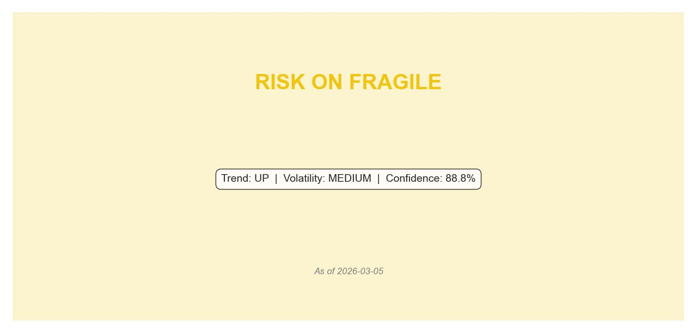
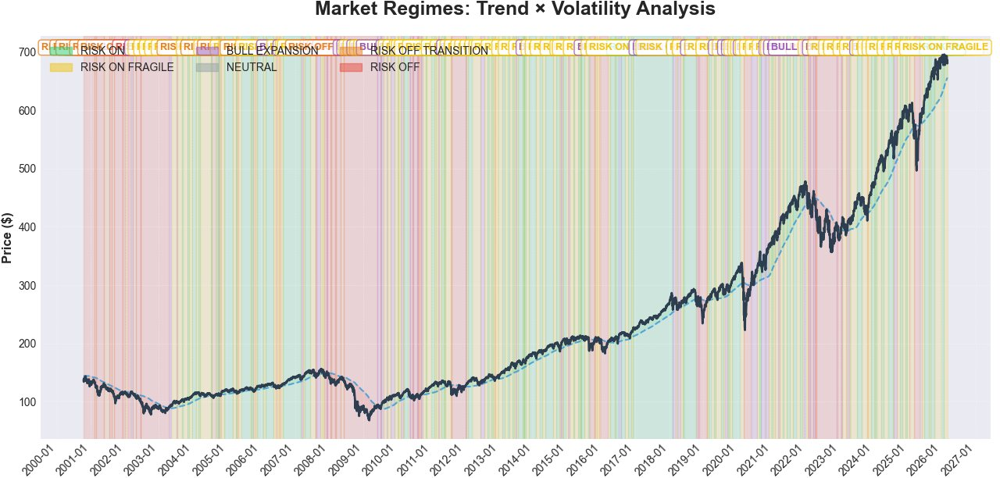
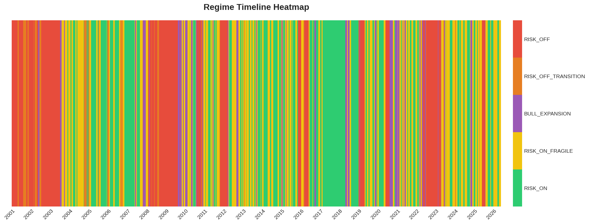
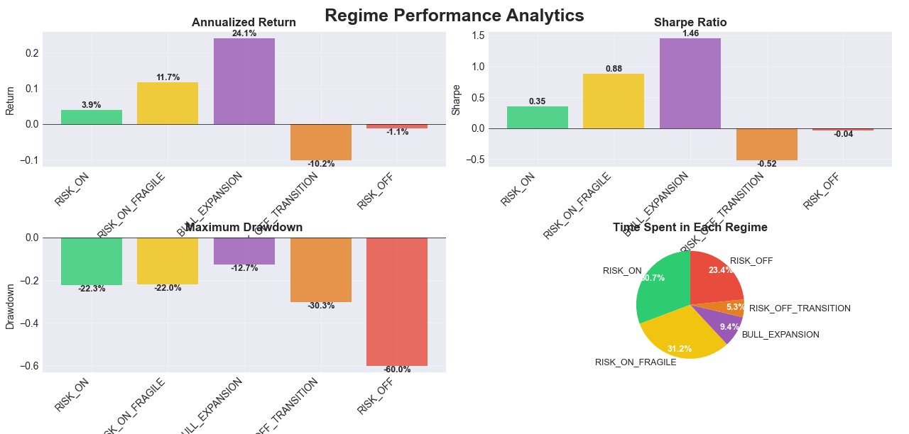
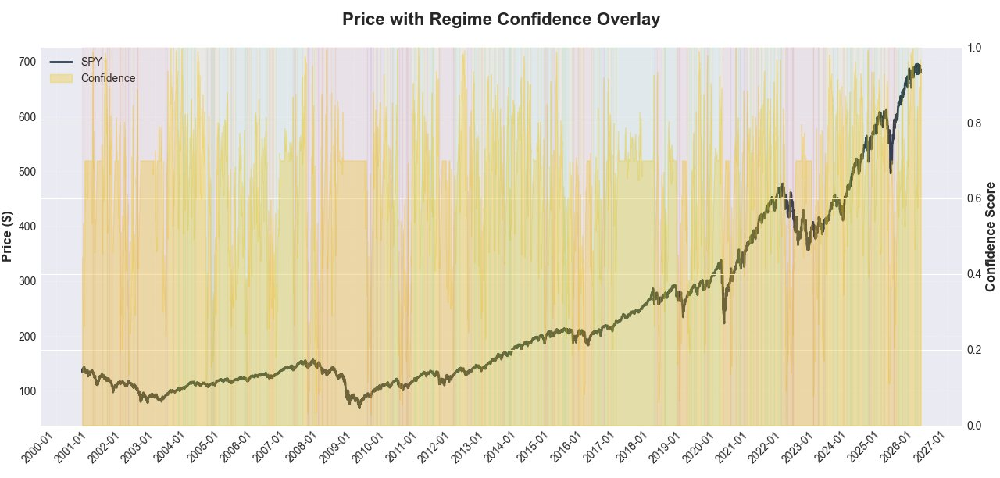
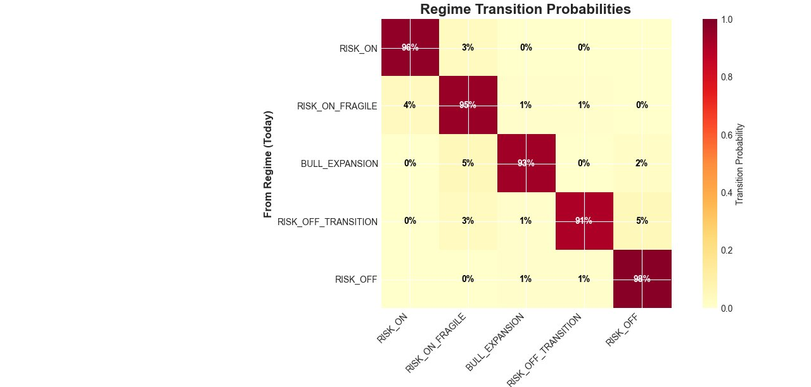

# Trend x Volatility Market Regime Detection

Most models try to predict tomorrow's return. That's an almost impossible problem. But there's a simpler question that actually has an answer:

**What kind of market are we in right now?**

A calm uptrend is completely different from a violent recovery. A quiet sell-off before a crash
looks nothing like a full panic. These environments need different behavior from a portfolio,
but most people treat them the same. This project classifies every trading day into one of
six clearly defined market regimes using nothing but price data. No external feeds, no analyst
estimates, no machine learning. Tested on 26 years of SPY data (6,383 trading days) and
every single classification traces back to the exact numbers that produced it.

---

## Current Signal

<table>
<tr>
<td width="55%">

**As of 2026-03-05**

```
Regime      RISK_ON_FRAGILE
Trend       UP       price is above the 200-day MA
Volatility  MEDIUM   vol in the middle tercile
Confidence  88.8%    well-established, not a borderline call
```

The uptrend is still intact, but volatility has crept into the middle zone.
Historically that means the setup is less clean than it looks. Not the time to add risk.
Hold existing positions with tighter controls and watch whether vol drops back down
toward RISK_ON or keeps climbing toward something worse.

</td>
<td width="45%">



</td>
</tr>
</table>

---

## The Six Regimes

| | Regime | Condition | Days | Ann. Return | Sharpe | Max DD |
|---|---|---|---|---|---|---|
| 🟢 | **RISK_ON** | UP trend + LOW vol | 1,962 (30.7%) | +3.9% | 0.35 | -22.3% |
| 🟡 | **RISK_ON_FRAGILE** | UP trend + MEDIUM vol | 1,989 (31.2%) | +11.7% | 0.88 | -22.0% |
| 🟣 | **BULL_EXPANSION** | UP trend + HIGH vol | 598 (9.4%) | +24.1% | 1.46 | -12.7% |
| ⚫ | **NEUTRAL** | Price near MA | rare | n/a | n/a | n/a |
| 🟠 | **RISK_OFF_TRANSITION** | DOWN trend + LOW/MEDIUM vol | 340 (5.3%) | -10.2% | -0.52 | -30.3% |
| 🔴 | **RISK_OFF** | DOWN trend + HIGH vol | 1,494 (23.4%) | -1.1% | -0.04 | -60.0% |

*SPY, Oct 2000 to Mar 2026.*

> **Why does RISK_ON show only 3.9% return?** It's a statistical artefact, not a real weakness.
> When you group 1,962 non-consecutive days scattered across 26 years, the compounding breaks down.
> When RISK_ON is analysed in proper calendar blocks, it produces Sharpe ratios between 0.64 and 2.18
> which is among the best of any regime in every single sub-period. The right number to look at is
> the Sharpe (0.35 gross) and the max drawdown (-22.3%), not the raw return. Full explanation
> in the [model manual](trend_volatility.pdf).

---

## 26 Years of Regimes at a Glance



Each background colour is a regime. The dark line is price and the dashed line is the 200-day
moving average. You can see the dot-com crash running red from 2000 to 2003, the 2008 GFC as
nearly a full year of deep red, the quiet and uninterrupted green block of 2017, the rapid
colour shift in 2020 as the COVID crash hit and then recovered, and the 2022 rate-hike bear
turning red again. No parameters were tuned to fit these events. This is what comes out
when you run the model on the data cold.

---

## The Full Timeline, Day by Day



Every single trading day from 2001 to 2026, one colour per day. This view makes it easy
to see how long each regime actually lasted. The 2017 green block is one
continuous stretch. The 2008 red block is relentless. The 2020 section shifts from red
to purple to yellow in a matter of months as the crash resolved and the recovery took hold.

---

## How Each Regime Actually Performed



Top left is annualised return, top right is Sharpe ratio, bottom left is max drawdown,
bottom right is how much of the 26-year history each regime occupied.

A few things stand out. BULL_EXPANSION has the best Sharpe (1.46) and
the shallowest drawdown (-12.7%) but it only shows up 9.4% of the time and the exits
can be brutal. RISK_OFF_TRANSITION is the most interesting one because it looks
calm on the surface but it loses -10.2% annualised. People often read that environment
as a buying opportunity. It usually isn't. RISK_OFF takes up nearly a quarter of all
trading days in the full history, which is more than most people expect.

---

## How Confident Is the Signal?



The dark line is price. The filled area behind it is the confidence score on the right axis.
What stands out in this chart is how clearly the score collapses to near zero at
every regime transition and then rebuild over the days that follow. A freshly confirmed regime
sitting at 35% confidence is a very different signal from one that has been running above 90%
for three weeks.

The score is built from three components:

```
Confidence = 0.4 x TrendScore     how far price is from the 200-day MA
           + 0.3 x VolScore       how far vol sits from its nearest boundary
           + 0.3 x DurationScore  how long this regime has been active
```

Across the full dataset it ranges from 0.03 to 1.0 with a mean of 0.63.

---

## How Regimes Move Into Each Other



Each cell is the daily probability of moving from one regime (the row) to another (the column).
The diagonal dominates because regimes are sticky. The interesting part is the off-diagonal.

Two things stand out to me. First, **RISK_ON never transitions directly to RISK_OFF (0%)**.
When a calm uptrend starts to break down the market always moves through an intermediate
state first. You always get a warning before the worst of it hits.

Second, **RISK_OFF_TRANSITION moves into RISK_OFF at 5% per day**. That sounds small but
over three weeks the cumulative probability of flipping into full RISK_OFF crosses 50%.
The time to reduce risk is when RISK_OFF_TRANSITION appears, not after volatility spikes and
RISK_OFF is confirmed. By then the damage is usually already happening.

---

## How to Run It

```bash
# 1. Clone the repo
git clone https://github.com/Sifeddine-Elouadai/Trend-Volatility-regime-detection.git
cd Trend-Volatility-regime-detection

# 2. Install dependencies (Python 3.10+)
pip install -r requirements.txt

# 3. Run on SPY (default)
python run.py

# 4. Or pass any ticker
python run.py QQQ
python run.py AAPL
python run.py GLD
```

Data downloads automatically from Yahoo Finance. No API keys needed. The ticker needs
at least 8 years of price history for the 200-day MA and calibration window to work properly.

Here is what happens when you run it, in order:

1. Download price data from Yahoo Finance
2. Compute log returns, 20-day realised vol, 200-day moving average, and trend distance
3. Load the volatility thresholds from the 2000-2020 calibration window (fixed constants, never updated)
4. Classify each day's trend as UP, DOWN, or NEUTRAL by comparing price to the 200-day MA
5. Classify each day's vol as LOW, MEDIUM, or HIGH using the thresholds, then smooth with a 5-day rolling majority vote
6. Map each (trend, vol) pair to one of the six regime names
7. Run the persistence filter: any regime that doesn't hold for 3 consecutive days is rejected and the previous one carries forward
8. Compute the confidence score for every day
9. Print the terminal signal, save six charts, and write two CSV files

**Sample terminal output:**
```
2026-03-05 | RISK_ON_FRAGILE   | Trend: UP   | Vol: MEDIUM | Conf: 88.8%
```

---

## Outputs

**Charts saved on every run:**

| File | What it shows |
|---|---|
| `txv_analysis.png` | 26-year price history with colour-coded regime backgrounds |
| `regime_timeline_heatmap.png` | Every trading day as a colour band from 2001 to present |
| `regime_confidence_overlay.png` | Price with confidence score on secondary axis |
| `performance_analytics.png` | Return, Sharpe, max drawdown, and time allocation per regime |
| `current_regime_card.png` | Today's regime, trend, vol, and confidence at a glance |
| `transition_probabilities.png` | Regime-to-regime daily transition rates |

**CSV files written on every run:**

| File | Contents |
|---|---|
| `regime_history.csv` | Day-by-day: date, price, trend state, vol state, regime, confidence |
| `regime_statistics.csv` | Per-regime: annualised return, vol, Sharpe, max drawdown, observation count |

---

## Project Structure

```
├── data.py               downloads and validates price data via yfinance
├── features.py           log returns, 20-day vol, 200-day MA, trend distance
├── method1.py            core engine: classification, persistence filter, confidence score
├── analytics.py          per-regime performance statistics
├── plotting.py           all six chart types
├── run.py                end-to-end pipeline, accepts any ticker as argument
├── requirements.txt
└── trend_volatility.pdf  complete model documentation (21 pages)
```

---

## Design Decisions

**No look-ahead bias.** The volatility thresholds are computed only on data from 2000 to 2020
and treated as fixed numbers from that point on. Using the full dataset including 2020-2026
would mean the model implicitly knows about COVID when classifying a day in 2005, because
those extreme 2020 values shift where the threshold sits. Fixing the thresholds to the
in-sample window eliminates this completely.

**No machine learning.** Everything is rule-based and deterministic. Every regime assignment
traces directly to that day's price and volatility values. Nothing is fitted, nothing is
optimised, and nothing could have silently overfit to the historical data.

**No external data.** The only input is a daily closing price. That's it.

---

## Limitations

**It lags.** The 200-day MA and 20-day vol window both look backward by definition. The
persistence filter adds at least 2 more days on top of that. Regime changes are confirmed
after the fact, not predicted.

**Thresholds are calibrated to SPY.** Applying this to individual stocks, bonds, or
commodities without recalibrating the volatility thresholds will give wrong results.
The SPY numbers do not transfer to an asset with a different volatility profile.

**Gross Sharpe ratios.** No risk-free rate has been subtracted from any figures shown.
Subtract the prevailing 3-month T-bill rate to get the true excess-return Sharpes.

**No transaction costs.** The backtest statistics assume frictionless execution.
Any real strategy acting on these signals will face trading costs.

---

## Documentation

[`trend_volatility.pdf`](trend_volatility.pdf) is the full 21-page technical write-up.
It covers the math behind every feature, the rationale for the 200-day MA and 20-day vol
window, a step-by-step numerical example showing exactly how look-ahead bias would corrupt
the 2005 classifications if full-dataset thresholds were used, the complete confidence score
derivation, the RISK_ON return paradox broken down sub-period by sub-period, and an
honest list of everything this model cannot do.

---

## Dependencies

```
yfinance   >= 0.2.40
pandas     >= 2.0.0
numpy      >= 1.26.0
matplotlib >= 3.8.0
```
